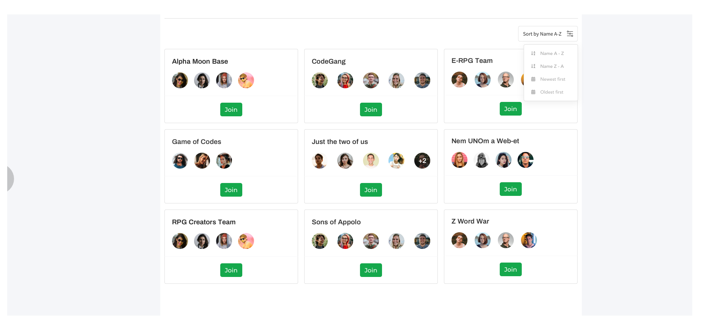

## Table of contents
* [General info](#general-info)
* [Prerequisites](#required-technologies)
* [Task description](#task-description)
* [A little help](#a-little-help)

# General info
Create a Spring Boot application with an Angular frontend based on the task description. You must use the technologies
listed below. It's up to you how you implement the task. Treat the sample code as a skeleton, in case you
feel there is room for improvement do not hesitate to add your changes.

Please make your work traceable by writing what you did in the 'WALKTHROUGH.md' file.

Please note you must present a working application by the end of the day.

# Required Technologies
* Java 8+ (OpenJDK)
* Gradle / Maven
* Angular

Optional:
* PostgreSQL 9+ / H2
* Docker

## Task description

This application must be able to manage users and teams who work on projects. A user can be a member of more than one
teams, and a team can work on more than one projects at the same time. Every user has a location which they work from and
every user has experience points (between 1 and 100) in several technologies (like js, Docker, Java and so on). 

The goal is to create a Spring Boot application that exposes a REST API and replaces the current mock_backend service 
while adding more features to the existing ones.
    
#### MVP:
   * Replace the mock_backend with a fully functional Spring Boot app
   * Store the data in database
   * Create a REST endpoint that responds with a JSON data in the same format as the `mock_backend` does. (For further 
   info take a look at the `How to start the mock backend` section)
   * Extend the application with the following features: 
     - Extend the database structure and java entities based on the task description 
     - Replace the background color with something way better
     - In the project UI display the average experience points of the people involved in the project (by technologies)
     - Find the user who is in touch with the most experienced and diverse tech knowledge mates amongst projects 
      she is involved with (who has the biggest chance to learn cool new stuff from colleagues) 
     - Create a 'hall-of-fame' component and display the top 3 teams (experience avg) and top 3 users (by location),
      place it on the index layout   
         

#### Nice to have
   * Increase quality and reliability
   * Implement basic authentication for the application
   * Create an editable (crud) user profile page

## A little help
The initial frontend layout looks the following:

  

#### How to start the mock backend:
 - native:  
 in mock_data folder run: `npm run mock`
 - docker:  
 in root folder run `docker-compose up -d`
 